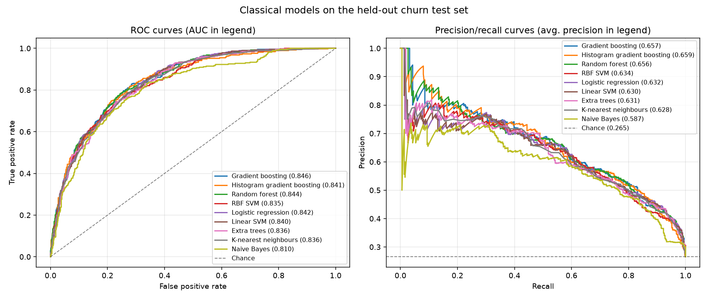

# Customer Churn Prediction

> **College project.** Built as coursework to practise an end-to-end machine learning
> workflow: exploratory analysis, feature selection, model comparison, and deployment
> behind a small web app. It is a learning exercise, not a production system.
>
> Forked from [codebrain001/customer-churn-prediction](https://github.com/codebrain001/customer-churn-prediction).

A Streamlit app that predicts whether a telecom customer is likely to churn, trained
on the Telco customer churn dataset (7,043 customers).

**Nine classical algorithms** are trained and shipped — logistic regression, linear
and RBF SVM, random forest, extra trees, gradient boosting, histogram gradient
boosting, k-nearest neighbours and naive Bayes. Any of them can be selected in the
app, and a *Compare all models* mode scores the same customers with every one. The
default is gradient boosting, tuned to catch churners rather than to maximise raw
accuracy — see [the model gallery](#the-model-gallery).


---

## What it does

Churn rate is a key indicator for subscription businesses. Identifying customers who
are unhappy with the service points at weaknesses in the product or pricing plan and
allows a company to act before the customer leaves.

The app supports the two ways such a model normally gets used:

- **Online prediction** — fill in one customer's details in a form and get a single
  prediction back, with the estimated probability of churn.
- **Batch prediction** — upload a CSV of customers and get a prediction and probability
  for every row.
- **Compare all models** — upload a CSV and score it with all nine algorithms at once,
  to see where they agree and where they part company.

---

## Running it

Requires **Python 3.11 or newer** — scikit-learn 1.9 and pandas 3.0 set that
floor, and numpy 2.5 wants 3.12. Verified on 3.13 and 3.14.

**1. Clone the repository and enter it**

```bash
git clone https://github.com/happyc0der/customer-churn-prediction.git && cd customer-churn-prediction
```

**2. Create a virtual environment and install the dependencies**

```bash
python3 -m venv .venv && source .venv/bin/activate && pip install -r requirements.txt
```

On Windows, activate with `.venv\Scripts\activate` instead.

**3. Start the app**

```bash
streamlit run app.py
```

Streamlit prints a local URL (usually <http://localhost:8501>) and opens it in your
browser. Run the command from the repository root so the app can find the saved model.

### Trying a prediction

Pick an algorithm from the **Algorithm** dropdown in the sidebar at any time; the
expander underneath it shows what that model is and how it scored. The list is
ordered best-first.

- **Online** — leave the sidebar on `Online`, fill in the form, and press **Predict**.
- **Batch** — switch the sidebar to `Batch`, upload a CSV, and press **Predict**.
  `data/batch_churn.csv` is a small sample you can use; `data/churn.csv` (the full
  dataset) also works.

#### Columns an uploaded file needs

Spelling matters. A value the model was not trained on cannot be encoded, so the
row is scored as though it held the most common value instead — a quiet wrong
answer rather than an error. The app checks for this and warns you, naming the
column and the value, but the accepted spellings are:

| Column | Accepted values |
| --- | --- |
| `SeniorCitizen` | `No`, `Yes` |
| `Dependents` | `No`, `Yes` |
| `tenure` | number |
| `PhoneService` | `No`, `Yes` |
| `MultipleLines` | `No`, `No phone service`, `Yes` |
| `InternetService` | `DSL`, `Fiber optic`, `No` |
| `OnlineSecurity` | `No`, `No internet service`, `Yes` |
| `OnlineBackup` | `No`, `No internet service`, `Yes` |
| `TechSupport` | `No`, `No internet service`, `Yes` |
| `StreamingTV` | `No`, `No internet service`, `Yes` |
| `StreamingMovies` | `No`, `No internet service`, `Yes` |
| `Contract` | `Month-to-month`, `One year`, `Two year` |
| `PaperlessBilling` | `No`, `Yes` |
| `PaymentMethod` | `Bank transfer (automatic)`, `Credit card (automatic)`, `Electronic check`, `Mailed check` |
| `MonthlyCharges` | number |
| `TotalCharges` | number |

`SeniorCitizen` is flexible: `Yes`/`No`, `1`/`0`, `true`/`false` and any
capitalisation all work, since the raw dataset and the app's own form spell it
differently. Extra columns are ignored, and a blank `TotalCharges` is filled with
the median from the training data.

### Retraining the models

```bash
python train.py
```

This retrains all nine algorithms and rebuilds `models/`. See
[the model gallery](#the-model-gallery).

### Running the tests

```bash
pip install -r requirements-dev.txt && pytest
```

62 tests covering the preprocessing, the saved models, the app (through
Streamlit's own `AppTest`, no browser needed), the notebook and `train.py`. They
run in about 20 seconds; `pytest -m "not slow"` skips the two that invoke
`train.py` and finishes in 10.

Nearly every test pins a bug that actually shipped in this repository, and each
is commented with the one it guards. They were validated by reintroducing those
bugs one at a time and confirming the suite goes red — all ten did.

Linting uses [ruff](https://docs.astral.sh/ruff/), configured in `ruff.toml` —
likely bugs, dead code, import order and a 100-character line limit:

```bash
ruff check
```

Both run on every push via GitHub Actions, against Python 3.11 and 3.13.

### Re-running the analysis notebook

The notebook holds the exploratory analysis and the original baseline model. It needs a
few extra packages:

```bash
pip install -r requirements-notebook.txt && jupyter lab notebook/EDA.ipynb
```

Run the cells in order — later cells depend on transformations applied by earlier ones.
The hyperparameter search cell fits 500 candidates across 30 cross-validation folds and
takes a while. The notebook does not overwrite the deployed models; `train.py`
produces those.

---

## Project structure

| Path | What it is |
| --- | --- |
| `app.py` | Streamlit app — the online and batch prediction screens |
| `train.py` | Trains all nine algorithms and writes `models/` |
| `preprocessing.py` | Prepares raw feature columns; shared by `train.py` and the app |
| `models/` | One fitted pipeline per algorithm, plus `index.json` describing them |
| `models/index.json` | Each model's hyperparameters, threshold, test scores and file size |
| `docs/model_comparison.png` | ROC and precision/recall curves for all nine |
| `notebook/EDA.ipynb` | Exploratory analysis and the original baseline model |
| `data/churn.csv` | The Telco churn dataset used for training (7,043 rows) |
| `data/batch_churn.csv` | Small sample file for trying out batch prediction |
| `tests/` | Regression tests, one per bug this project has had |
| `requirements.txt` | Dependencies for the app and for retraining |
| `requirements-dev.txt` | Adds pytest and ruff, for tests and linting |
| `ruff.toml` | Lint rules, shared by local runs and CI |
| `.github/workflows/tests.yml` | Runs the linter and the tests on every push |
| `requirements-notebook.txt` | Extra dependencies for the notebook and the comparison plot |

---

## The model gallery

`train.py` trains **nine classical algorithms**, tunes a decision threshold for
each, scores them all on the same held-out test set, and saves every fitted
pipeline to `models/`. The app can predict with any of them — pick one from the
**Algorithm** dropdown in the sidebar.

```bash
python train.py
```

Takes about a minute, and is deterministic — every seed is fixed, so a re-run
reproduces byte-identical model files.

| Flag | What it does |
| --- | --- |
| `--quick` | Reduced search; useful as a smoke test |
| `--no-save` | Report the results without writing anything |
| `--only <slug>` | Retrain just these models, keeping the rest of the gallery |

Slugs are the filenames in `models/` without the extension, for example
`python train.py --only naive_bayes knn`.

### What it does

1. **Holds out a stratified 20% test set** up front, and touches it exactly once
   at the end.
2. **Puts every preprocessing step inside the pipeline** — median imputation for
   the blank `TotalCharges` values, standard scaling, and one-hot encoding — so
   each step is fitted on the training fold only.
3. **Searches each algorithm** with randomised hyperparameter search and 5-fold
   cross-validation.
4. **Selects on average precision**, not accuracy. Only ~26.5% of customers churn,
   so a model that never predicts churn already scores 73.5% accuracy.
5. **Tunes a decision threshold per model** for F1, by cross-validation on the
   training set. Each model is therefore compared at its own best operating
   point rather than at an arbitrary shared 0.5, and the threshold is saved with
   the model so `predict()` uses it.

### Results



On the held-out test set (1,409 customers, 374 of whom churned), each model at
its own tuned threshold:

| Model | Family | Recall | Precision | F1 | Bal. acc. | Accuracy | ROC AUC | PR AUC | Thr. |
| --- | --- | --- | --- | --- | --- | --- | --- | --- | --- |
| **Gradient boosting** | Boosted trees | 0.751 | 0.545 | **0.631** | 0.762 | 0.767 | **0.846** | 0.657 | 0.31 |
| Histogram gradient boosting | Boosted trees | 0.706 | 0.568 | 0.629 | 0.756 | 0.779 | 0.841 | **0.659** | 0.60 |
| Random forest | Bagged trees | **0.805** | 0.513 | 0.626 | **0.764** | 0.745 | 0.844 | 0.656 | 0.49 |
| RBF SVM | Support vector machine | 0.743 | 0.537 | 0.623 | 0.756 | 0.762 | 0.835 | 0.634 | 0.41 |
| Logistic regression | Linear | 0.730 | 0.541 | 0.621 | 0.753 | 0.764 | 0.842 | 0.632 | 0.57 |
| Extra trees | Bagged trees | 0.733 | 0.539 | 0.621 | 0.753 | 0.763 | 0.836 | 0.631 | 0.56 |
| Linear SVM | Support vector machine | 0.719 | 0.539 | 0.616 | 0.749 | 0.762 | 0.840 | 0.630 | 0.34 |
| K-nearest neighbours | Instance based | 0.733 | 0.531 | 0.616 | 0.749 | 0.757 | 0.836 | 0.628 | 0.38 |
| Naive Bayes | Probabilistic | 0.757 | 0.504 | 0.605 | 0.744 | 0.738 | 0.810 | 0.587 | 0.99 |

Gradient boosting wins on cross-validated average precision and is what the app
loads by default.

### What the comparison actually shows

**The algorithms barely differ.** Eight of the nine sit inside 0.015 F1 of each
other, and their ROC curves in the chart above are almost on top of one another.
Only naive Bayes clearly trails, and for a understandable reason: it assumes every
feature is independent given the outcome, and here `InternetService`,
`OnlineSecurity` and `StreamingTV` are obviously entangled.

That is the honest result for this dataset, and it is worth more than a leaderboard:
churn on these 16 features is close to a linear problem, so the extra capacity of
kernels and tree ensembles has little left to find. Picking a fancier algorithm was
never going to be the lever.

**The threshold was the lever.** Moving off the default 0.5 cut-off changed far more
than the choice of model. Against the project's original logistic regression, out of
the 374 customers who actually churned:

| | Original model | Current default |
| --- | --- | --- |
| | Logistic regression @ 0.5 | Gradient boosting @ 0.31 |
| Churners caught | 216 | **281** |
| Churners missed | 158 | **93** |
| False alarms | **117** | 220 |
| Accuracy | **0.805** | 0.767 |
| Recall | 0.578 | **0.751** |

Accuracy *falls*. That is the intended trade: for a retention campaign, contacting a
happy customer is cheap and losing one silently is not. Note also that the original
model's figures flatter it — it was trained on a 70/30 split of the full dataset, so
it had already seen most of this test set.

**Models disagree most where it matters.** Try *Compare all models* in the sidebar
and upload `data/batch_churn.csv`. The same customer can be scored 26% by gradient
boosting and 85% by naive Bayes. Naive Bayes in particular returns near-0% and
near-100% probabilities — confident and poorly calibrated, which is exactly what its
independence assumption produces.

---

## Notes

Every file in `models/` is a complete scikit-learn pipeline: it takes the raw
feature columns and does its own imputation, scaling and encoding. Keeping
preprocessing inside the saved model is deliberate — when the encoding lives in
two places it drifts, and the model ends up scoring features that do not mean what
it was trained on.

`preprocessing.py` is the single entry point that prepares raw columns, used by both
`train.py` and the app, for the same reason.

A few practical constraints are baked into `train.py`:

- **Forest depth is bounded.** An unpruned 800-tree forest pickles to ~160 MB, which
  has no business in a git repository. Bounding depth and leaf size costs about 0.002
  average precision and keeps the whole gallery near 6 MB.
- **Both SVMs are wrapped in `CalibratedClassifierCV`.** `SVC`'s own `predict()`
  follows the class-weighted decision boundary while its `predict_proba()` is Platt-
  scaled to the original class balance, so the two disagree; thresholding such a
  probability is unsound. Explicit calibration makes them agree.
- **The linear SVM uses `LinearSVC`, not `SVC(kernel='linear')`.** libsvm's linear
  kernel did not finish three candidates in five minutes on 5,634 rows; liblinear
  finishes in one second.

**Library versions.** Pickled models are tied to the library that wrote them, so
`models/index.json` records the scikit-learn and Python versions used — currently
scikit-learn 1.9.1 on Python 3.13. Loading the models with an older scikit-learn may
print an `InconsistentVersionWarning`; `python train.py` regenerates them with
whatever you have installed.

The notebook holds the exploratory analysis and the original baseline. Its scaling is
fitted before the train/test split, so its reported scores are mildly optimistic;
`train.py` supersedes it for training the deployed models.
